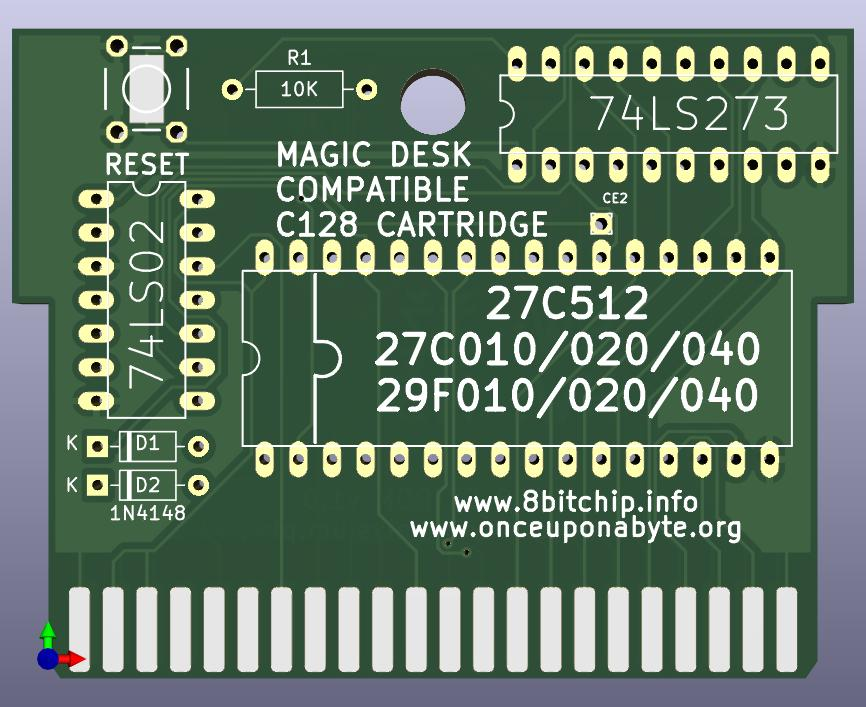

# MagicDesk-like External ROM cartridge for C128

This is a clone of [Magic Desk 512k](https://github.com/msolajic/c64-magic-desk-512k) by Marko Šolajić
converted to KiCad 6 format and modified to work as an External ROM cartridge for C128 and map 32K of ROM at a time.



There is another project [Magic Desk 128](https://github.com/RetroNynjah/Magic-Desk-128) with a similar goal, but it uses only `/ROML` signal and maps 16K at a time.
This makes it impossible e.g. to put The Servant on such cartridge.

## Hardware

The [schematic is here](kicad/plots/c128-magicdesk.pdf).

The main difference to C64 version is that this cartridge is meant for C128, so `/EXROM` signal is no longer connected to prevent from entering C64 mode automatically.

Two diodes and a pullup resistor perfrom AND function on `/ROML` and `/ROMH` to map whole 32K at a time ($8000-$FFFF).

Because the bank size is now 32K instead of 8K the lowest two bits of control register are not connected.

[kicad](kicad/) folder contains all the KiCad 6.0 project files and [kicad/plots](kicad/plots) all the Gerber files needed to produce PCB.

Please read the notes from the [original project](https://github.com/msolajic/c64-magic-desk-512k).

The jumper configuration for various EPROMS/EEPROMS/FLASH chips is exactly the same, as well as possible expanstion to 1MB.

## Programming

Data from ROM will appear as External Function ROM mapped in $8000-$FFFF area (32K).

ROM banks can be changed from BASIC.

```
BANK15:POKEDEC("DE00"),4*<rom bank>
```

There are 16 banks in a 512K EEPROM and 32 banks if you piggy-back two of them and connect `/CE2` signal as described for C64 Magic Desk 512K.

RESET will always enable bank 0.

It's easy to check the ROM data from C128 monitor, just use `8` as the bank number:

```
M 88000 880FF
```

Reading from $DE00 register will switch bank to a random value (what happened to be on the data bus), don't do that.

## Cartrige ROM generator

No such thing yet.

## Emulator Support

None :)
